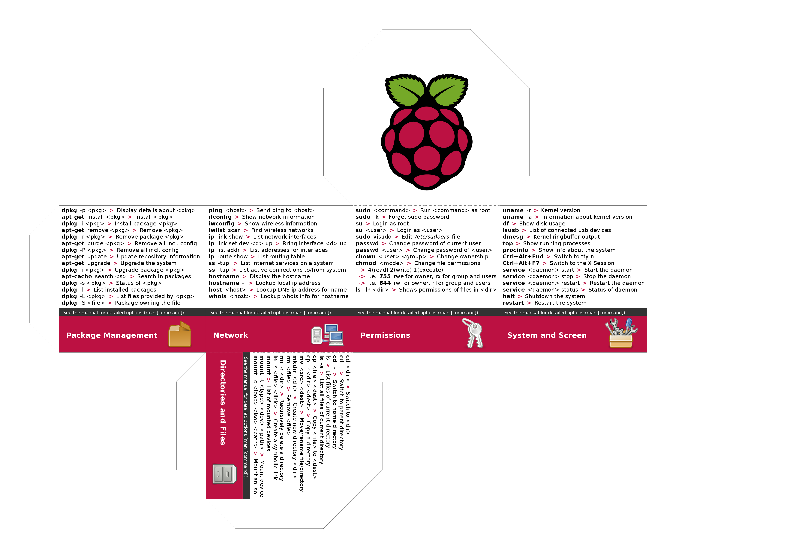

# Cubify

Cubify is a free Inkscape plugin to create Cheat Cubes

## Introduction

Cubify is a plugin for the famous vector graphics software **Inkscape**. To install this plugin you should first download the sources from GitHub:

    $ git clone https://github.com/Avedo/Cubify

Then you can move the downloaded files to the extentions folder of your Inkscape installation:

    $ sudo cp ./Cubify/* /usr/share/inkscape/extentions/

If you now start Inkscape, you should see a new entry in the `Extentions -> Python` submenu, named Cubify. Open a new document and start the Cubify extention wizzard located under `Extentions -> Python -> Cubify ...`. Here you can change different options modifying the look and feel as well as the content of your cheat cube. When you entered all important data, click `Apply` and close the wizzard. You will see the scheme of your custom Cheat Cube. If the skeleton does not fit the document layout, visit `Files -> Document Properties ...` and choose `Resize page to content ...` at the bottom of the dialog. Select `Resize page to drawing or selection` and close the dialog. Now the skeleton of your Cheat Cube should exactly fit the document. 

## ToDos

- [x] Select cube width and height based on parent object
- [ ] Use selected object instead of whole document
- [ ] Add controls for the font-size, -color and -weight
- [x] Embedd images directly instead of referencing them
- [ ] Implement vectorization of common image types
- [ ] Rotate buttom of the cube 90 degrees clockwise
- [ ] Wrap the different subparts in groups